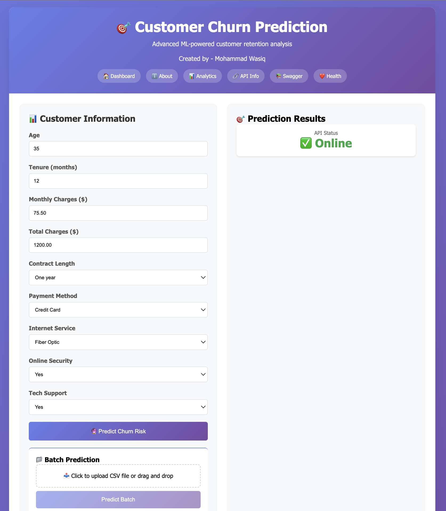
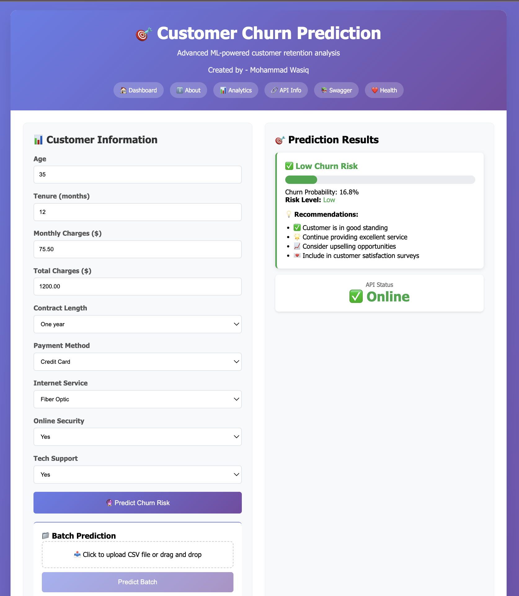
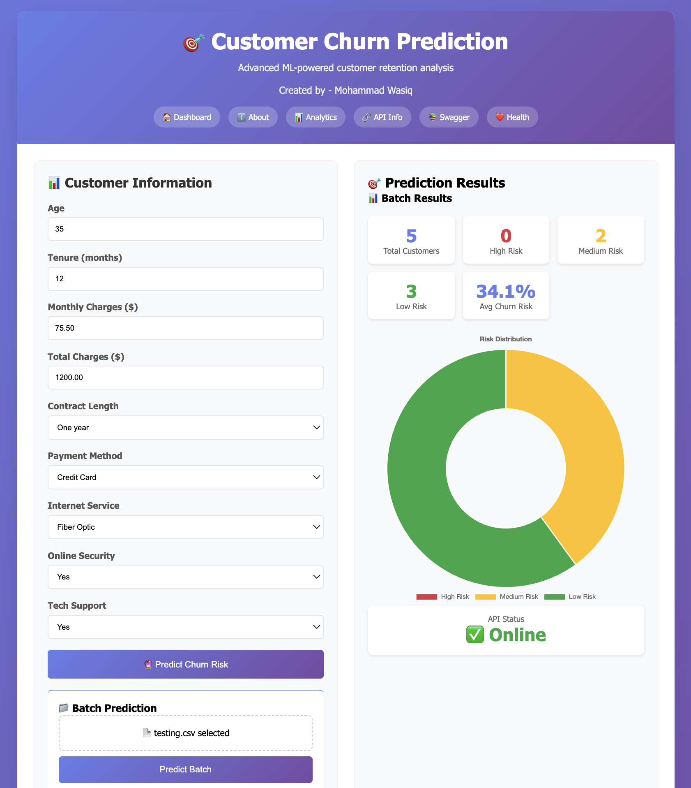
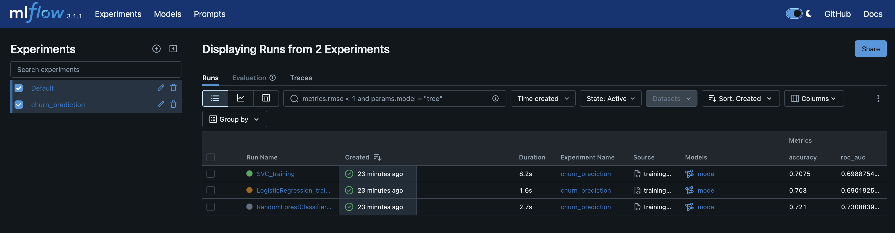
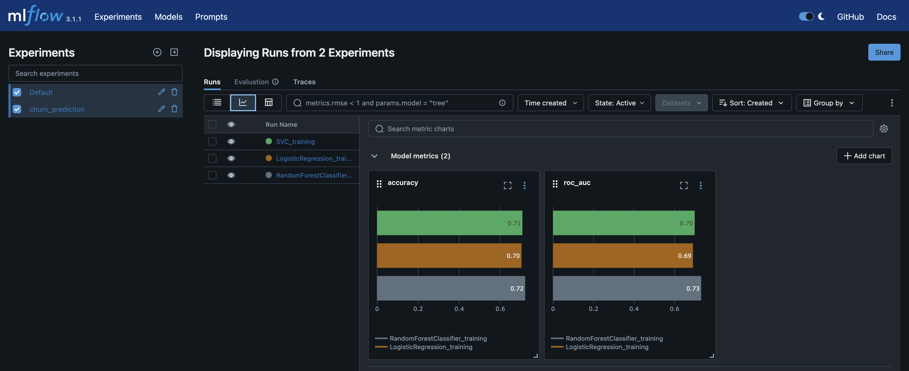

# Customer Churn Prediction ML Project

A complete end-to-end machine learning project for predicting customer churn with production-ready deployment.


## 📁 Project Structure

```
churn_prediction_ml/
├── src/                    # Source code
│   ├── data/              # Data processing modules
│   ├── models/            # Model training and evaluation
│   ├── pipeline/          # Training and prediction pipelines
│   ├── monitoring/        # Model and data monitoring
│   ├── utils/             # Utility functions
│   └── config/            # Configuration management
├── api/                   # FastAPI application
├── tests/                 # Test cases
├── docker/                # Docker configuration
├── deployment/            # Kubernetes/Terraform configs
├── config/                # Configuration files
├── notebooks/             # Jupyter notebooks
└── data/                  # Data storage
```

## Application

### Home



### Prediction



### Batch Prediction



### MLFlow



---




## 🛠️ Features

- **End-to-End Pipeline**: Complete ML workflow from data ingestion to deployment
- **API-First Design**: RESTful API with automatic documentation
- **Model Monitoring**: Data drift detection and model performance monitoring
- **Containerized**: Docker support for easy deployment
- **CI/CD Ready**: GitHub Actions workflow included
- **Production Ready**: Proper logging, error handling, and health checks
- **Configurable**: YAML-based configuration management
- **Testing**: Comprehensive unit and integration tests

## 🔧 Installation

### Prerequisites
- Python 3.8+
- Docker (optional)
- Git

### Local Development

1. Clone the repository:
```bash
git clone https://github.com/MohammadWasiq0786/Customer-Churn-Prediction-ML-Project.git
cd churn_prediction_ml
```

2. Setup development environment:
```bash
python setup.py
```

3. Create Virtual Environment
```bash
uv init
```

```bash
uv venv
```

```bash
source uv .venv/bin/activate. # For MAC
source uv .venv/Scripts/activate. # For Window
```

```bash
uv pip install --upgrade pip
```

```bash
uv pip install -r requirements.txt
```

```bash
uv pip install -e .
```

3. Train the model:
```bash
python -m src.pipeline.training_pipeline
```

**Note:** If you face any error, please remove/delete `artifacts/` and `mlruns/` directories

4. Start API server
```bash
uvicorn api.main:app --reload
```

5. Access the API at http://localhost:8000

6. Run MLFlow
```bash
mlflow ui
```

7. Access the MLFlow Dashboard at http://127.0.0.1:5000

8. Run tests
```bash
pytest tests/ -v --cov=src --cov-report=html --cov-report=term
```


### Build Docker image
1. Build:
```bash
docker build -f docker/Dockerfile -t churn-prediction:latest .
```

2. docker-up:
```bash
docker-compose -f docker/docker-compose.yml up -d
```

3. docker-down:
```bash
docker-compose -f docker/docker-compose.yml down
```

4. Access the API at http://localhost:8000

## 📊 API Usage

### Single Prediction

```python
import requests

data = {
    "age": 35,
    "tenure": 12,
    "monthly_charges": 75.5,
    "total_charges": 1200.0,
    "contract_length": 12,
    "payment_method": "Credit Card",
    "internet_service": "Fiber Optic",
    "online_security": "Yes",
    "tech_support": "Yes"
}

response = requests.post("http://localhost:8000/predict", json=data)
print(response.json())
```

### Batch Predictions

```python
import requests

customers = [
    {
        "age": 35,
        "tenure": 12,
        "monthly_charges": 75.5,
        "total_charges": 1200.0,
        "contract_length": 12,
        "payment_method": "Credit Card",
        "internet_service": "Fiber Optic", 
        "online_security": "Yes",
        "tech_support": "Yes"
    },
    # ... more customers
]

response = requests.post("http://localhost:8000/batch_predict", json=customers)
print(response.json())
```

## 🧪 Testing

# Run tests
test:
	

# Run linting
lint:
	
	

Run tests:
```bash
pytest tests/ -v --cov=src --cov-report=html --cov-report=term
```

Run linting:
```bash
flake8 src/ api/ tests/ --max-line-length=120

black --check src/ api/ tests/
```

Format code:
```bash
black src/ api/ tests/
isort src/ api/ tests/
```

## 📈 Monitoring

The project includes comprehensive monitoring:s

- **Data Drift Detection**: Statistical tests to detect feature drift
- **Model Performance**: Track prediction accuracy and distribution
- **API Monitoring**: Health checks and performance metrics

Access monitoring dashboards:
- MLflow: http://localhost:5000
- Prometheus: http://localhost:9090  
- Grafana: http://localhost:3000

## 🚀 Deployment

### Local Docker Deployment

```bash
make docker-up
```

### Kubernetes Deployment

```bash
kubectl apply -f deployment/kubernetes/
```

### CI/CD Pipeline

The project includes a GitHub Actions workflow that:
- Runs tests on every push/PR
- Builds Docker images on main branch
- Deploys to staging/production environments

## 📝 Configuration

Update `config/config.yaml` to customize:
- Model hyperparameters
- Data paths
- API settings
- Monitoring thresholds

## 🤝 Contributing

1. Fork the repository
2. Create a feature branch
3. Make your changes
4. Run tests: `make test`
5. Submit a pull request

## 📄 License

This project is licensed under the MIT License.

## 🆘 Support

For issues and questions:
1. Check the documentation at http://localhost:8000/docs
2. Review existing issues on GitHub
3. Create a new issue with detailed information

## 🗺️ Roadmap

- [ ] A/B testing framework
- [ ] Real-time streaming predictions
- [ ] Advanced monitoring dashboards
- [ ] Model ensemble support
- [ ] Multi-cloud deployment support
